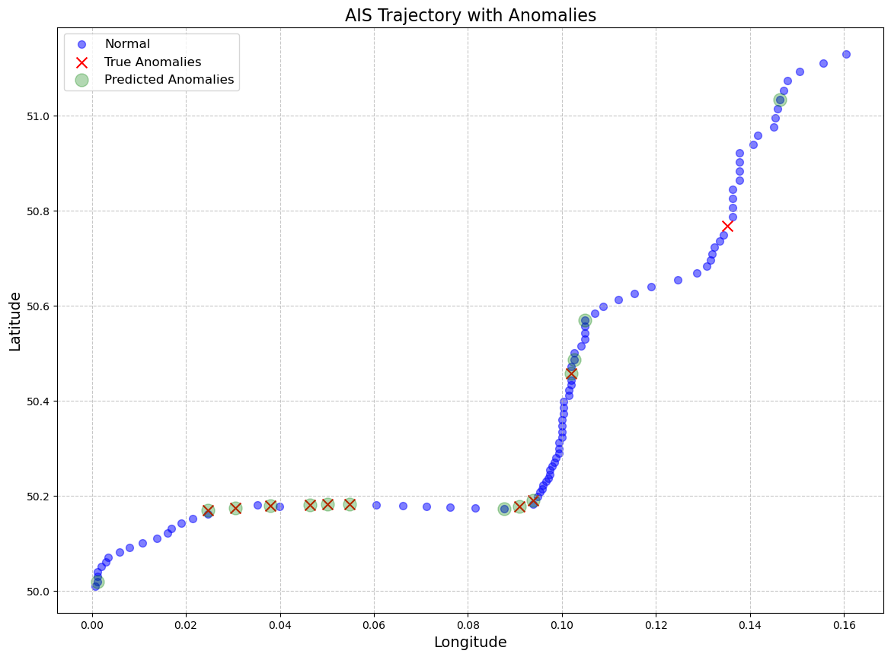

# AIS Anomaly Detection with Reinforcement Learning

## Informacje ogólne:
Projekt ten implementuje podejście oparte na uczeniu ze wzmocnieniem (RL) w celu wykrywania anomalii we wzorcach ruchu statków przy użyciu symulowanych danych systemu AIS. System generuje syntetyczne trajektorie AIS oraz szkoli agenta Q-learning w celu identyfikacji anomalii (np. nagłych zmian kursu lub prędkości) i wizualizuje wyniki. Projekt służy jako dowód koncepcji zastosowania RL do wykrywania anomalii morskich, z potencjalnymi zastosowaniami w bezpieczeństwie morskim, wykrywaniu nielegalnych działań i zapobieganiu kolizjom.




## Funkcjonalności:

- Generator fałszywych danych AIS: Symuluje trajektorie statków z szerokością i długością geograficzną, prędkością, kursem i czasem, w tym normalne i anomalne zachowania.

- Środowisko RL: Niestandardowe środowisko "gym" do przetwarzania danych AIS i szkolenia agenta RL.

- Q-learning Agent: Prosty algorytm RL do klasyfikowania ruchów statków jako normalnych lub anomalii.

- Wizualizacja: Wykreśla trajektorię z normalnymi punktami, prawdziwymi anomaliami i przewidywanymi anomaliami przy użyciu matplotlib.

- Dane wyjściowe: Zapisuje trajektorię i przewidywania do pliku CSV w celu dalszej analizy.


## Wymagania wstępne:

Do uruchomienia projektu wymagany jest Python 3.6+ oraz następujące biblioteki:

- numpy - Do operacji numerycznych i generowania danych.

- gym - Do tworzenia środowiska RL

- pandas - Do zapisywania wyników w formacie CSV.

- matplotlib - Do wizualizacji trajektorii.

Zainstaluj zależności za pomocą:

```
pip install numpy gym pandas matplotlib
```

## Jak to działa: 

- AIS Generator:

    - Generuje syntetyczną trajektorię 100 kroków z 10% prawdopodobieństwem wystąpienia anomalii (nagłych zmian prędkości lub kursu).

    - Każdy krok zawiera: szerokość geograficzną, długość geograficzną, prędkość, kurs, czas i flagę anomalii (0 dla normalnej, 1 dla anomalii).

- RL Environment:
    - Zbudowany przy użyciu frameworka gym.

    - Stany: Wektor danych AIS [lat, lon, prędkość, kurs, czas].

    - Działania: Klasyfikuje bieżący krok jako normalny (0) lub anomalny (1).

    - Nagrody: +1 za poprawną klasyfikację, -1 za niepoprawną.

- Q-learning Agent:
    - Używa tabeli Q, aby nauczyć się najlepszego działania dla każdego stanu.

    - Równoważy eksplorację (losowe akcje z epsilon=0.1) i eksploatację.

    - Dla uproszczenia dyskretyzuje ciągłe dane AIS.

- Visualization:
    - Wykresy trajektorii z różnymi znacznikami dla punktów normalnych, prawdziwych anomalii i przewidywanych anomalii.


## Ograniczenia:

- Uproszczony model AIS: Generator wykorzystuje podstawowe zasady ruchu bez rzeczywistych czynników, takich jak prądy morskie lub przepisy morskie bądź odpoiweidnia częstotliwość.

- Skalowalność: Podejście oparte na tabelach Q nie jest odpowiednie dla dużych, wielowymiarowych danych.

